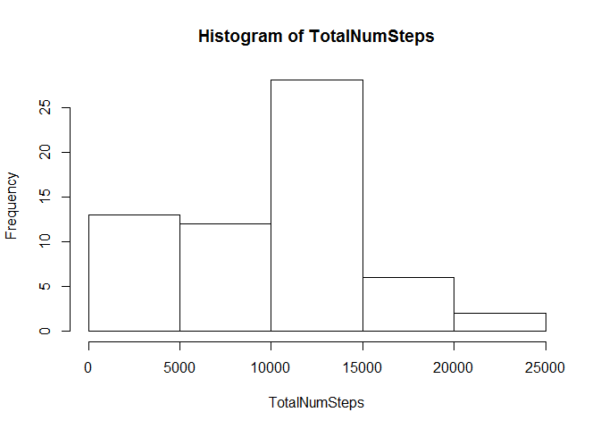
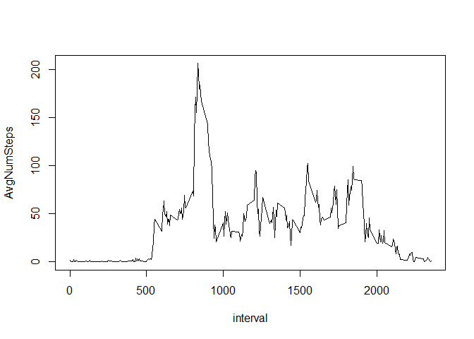
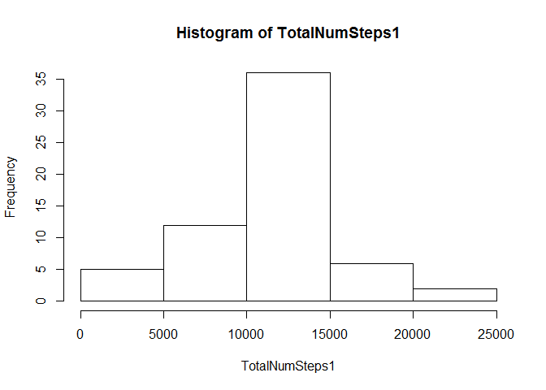
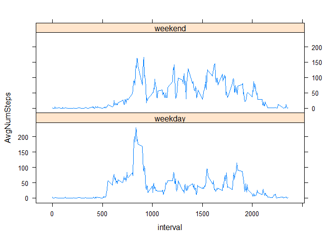

# Reproducible Research: Peer Assessment 1

This is R Markdown document that is created for the purpose of Peer Assessment 1 of Reproducibe Research course with Coursera. 

This assignment makes use of data from a personal activity monitoring device. This device collects data at 5 minute intervals through out the day. The data consists of two months of data from an anonymous individual collected during the months of October and November, 2012 and include the number of steps taken in 5 minute intervals each day.

The variables included in this dataset are:

1. **steps**: Number of steps taking in a 5-minute interval (missing values are coded as NA)

2. **date**: The date on which the measurement was taken in YYYY-MM-DD format

3. **interval**: Identifier for the 5-minute interval in which measurement was taken


The dataset is stored in a comma-separated-value (CSV) file and there are a total of 17,568 observations in this dataset.


The assignemnt focus around six different areas:


1. Loading and preprocessing the data


2. What is mean total number of steps taken per day?


3. What is the average daily activity pattern?


4. Imputing missing values


5. Are there differences in activity patterns between weekdays and weekends?


So, let's go through them one by one.


**Loading and preprocessing the data.**

We're going to read the data that is saved in csv format in a working directory and name it **data**.


```r
data <- read.csv("activity.csv")
```


If you want to have a summary of data, you can easily use **summary** and **str** functions.


```r
summary(data)
```

```
##      steps                date          interval     
##  Min.   :  0.00   2012-10-01:  288   Min.   :   0.0  
##  1st Qu.:  0.00   2012-10-02:  288   1st Qu.: 588.8  
##  Median :  0.00   2012-10-03:  288   Median :1177.5  
##  Mean   : 37.38   2012-10-04:  288   Mean   :1177.5  
##  3rd Qu.: 12.00   2012-10-05:  288   3rd Qu.:1766.2  
##  Max.   :806.00   2012-10-06:  288   Max.   :2355.0  
##  NA's   :2304     (Other)   :15840
```

```r
str(data)
```

```
## 'data.frame':	17568 obs. of  3 variables:
##  $ steps   : int  NA NA NA NA NA NA NA NA NA NA ...
##  $ date    : Factor w/ 61 levels "2012-10-01","2012-10-02",..: 1 1 1 1 1 1 1 1 1 1 ...
##  $ interval: int  0 5 10 15 20 25 30 35 40 45 ...
```


As we can see **date** is represented as factor, let's change its class to **Date**.

```r
data$date <- as.Date(data$date, "%Y-%m-%d")
```


**What is mean total number of steps taken per day?**

In this part, we're going to ignore the missing values.

1. Calculate the total number of steps taken per day.

We will be using here plyr package:


```r
library(plyr)
```

```
## Warning: package 'plyr' was built under R version 3.1.2
```

```r
x <- ddply(data, .(date),summarize,TotalNumSteps = sum(steps,na.rm=TRUE))
```

The above code chunk gives as total number of steps ( NA removed) by date.

2. Let's make a histogram representing the data:

```r
TotalNumSteps <- x$TotalNumSteps
hist(TotalNumSteps)
```

 

3. To calculate the mean and median of the total number of steps taken per day: 


```r
mean(TotalNumSteps)
```

```
## [1] 9354.23
```

```r
median(TotalNumSteps)
```

```
## [1] 10395
```

Therefore, mean is equal to 9354.23 and median is equal to 10395.


**What is the average daily activity pattern?**

1. Make a time series plot (i.e. `type = "l"`) of the 5-minute interval (x-axis) and the average number of steps taken, averaged across all days (y-axis)


```r
y <- ddply(data, .(interval),summarize,AvgNumSteps = mean(steps,na.rm=TRUE))

plot(y, type ='l')
```

 

2. Which 5-minute interval, on average across all the days in the dataset, contains the maximum number of steps?

To answer the question we're going to write the following:

```r
y[which.max(y$AvgNumSteps),]
```

```
##     interval AvgNumSteps
## 104      835    206.1698
```

Therefore, the interval that has got the max number of average steps is 835.


**Imputing missing values**

Note that there are a number of days/intervals where there are missing values (coded as `NA`). The presence of missing days may introduce bias into some calculations or summaries of the data.

1. Calculate and report the total number of missing values in the dataset (i.e. the total number of rows with `NA`)

length(which(is.na(data$steps)))

Total number of missing values is .....

2. Devise a strategy for filling in all of the missing values in the dataset. The strategy does not need to be sophisticated. For example, you could use the mean/median for that day, or the mean for that 5-minute interval, etc.

First of all, im going to split our data frame into two - one without missing values, another one containing only those rows that have got missing entries.


```r
notNAvalues <- data[complete.cases(data),]
navalues <- data[which(is.na(data$steps)),]
```

Then, im going to use data frame that i obtained in previous task, i.e. data frame `y`, that gives us average number of steps per interval. This way im going to complete missing values ( I'm using `merge` fucntion here and choose only 4th, 3rd and 1st column to appear in the final data; also i'm making sure that the column names are appropriate), so i'm assuming that specifc interval has got the same average num of steps, independant on a date.


```r
mergedData <- merge(navalues,y,by.x="interval",by.y="interval")
mergedData1 <-mergedData[,c(4,3,1)]
colnames(mergedData1 ) <- c("steps","date","interval")
```


3. Create a new dataset that is equal to the original dataset but with the missing data filled in.

To create a new data set with missing values in, im going to aggregate (`rbind`) two previously mentioned data frames.


```r
total <-rbind(notNAvalues,mergedData1)
```


4. Make a histogram of the total number of steps taken each day and Calculate and report the mean and median total number of steps taken per day. Do these values differ from the estimates from the first part of the assignment? What is the impact of imputing missing data on the estimates of the total daily number of steps?


To compare how the data changed when completeing missing values, we;re going to create histogram and calculate mean and median on our new data set.

```r
x1 <- ddply(total, .(date),summarize,TotalNumSteps = sum(steps))
TotalNumSteps1 <- x1$TotalNumSteps
hist(TotalNumSteps1)
```

 

```r
mean(TotalNumSteps1)
```

```
## [1] 10766.19
```

```r
median(TotalNumSteps1)
```

```
## [1] 10766.19
```

So our new mean is 10766.19 and median is also 10766.19.


We can see that completing missing values changed the output. Before, mean was lower than median, this time mean is equal to median and is equal to... The impact of taking into consideration missing values might give us an idea what is overall performance for whole population.


**Are there differences in activity patterns between weekdays and weekends?**

We will be using the dataset with the filled-in missing values for this part.

1. Create a new factor variable in the dataset with two levels - "weekday" and "weekend" indicating whether a given date is a weekday or weekend day.


```r
total$Weekday <-ifelse(weekdays(as.Date(total$date)) %in% c('Saturday','Sunday'), "weekend", "weekday")
```


2. Make a panel plot containing a time series plot (i.e. type = "l") of the 5-minute interval (x-axis) and the average number of steps taken, averaged across all weekday days or weekend days (y-axis). See the README file in the GitHub repository to see an example of what this plot should look like using simulated data.

```r
z <- ddply(total, .(interval,Weekday),summarize,AvgNumSteps = mean(steps))
z$Weekday <- as.factor(z$Weekday)
library(lattice)
```

```
## Warning: package 'lattice' was built under R version 3.1.2
```

```r
xyplot(AvgNumSteps~ interval|Weekday,z, type='l',layout=c(1,2))
```

 


